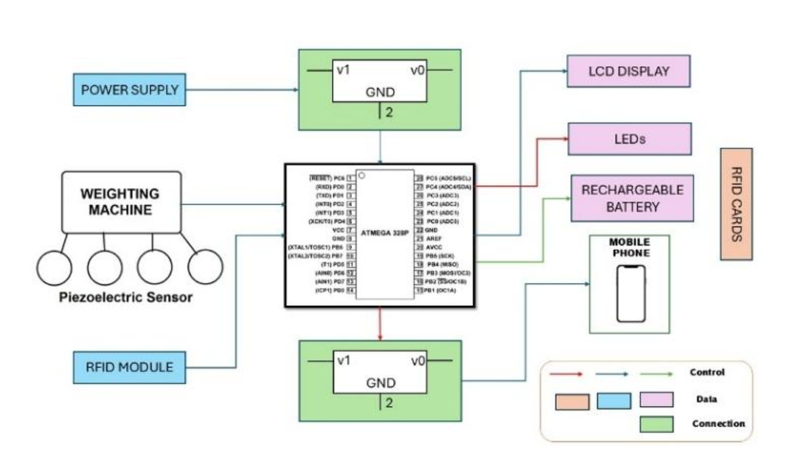
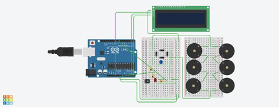
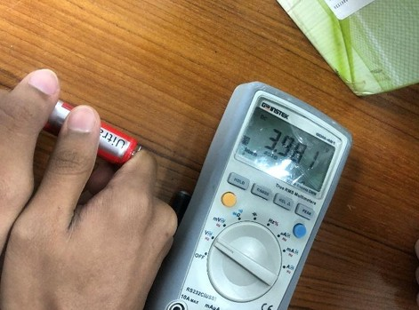

#  Intelligent Footstep Energy Harvesting System with Secure RFID Authentication

An intelligent microcontroller-based energy harvesting system that converts kinetic energy from human footsteps into usable electrical energy and integrates secure RFID authentication for controlled device charging.

---

##  Overview

This project presents a sustainable and secure approach to energy harvesting in semi-crowded environments. The system uses multiple piezoelectric sensors to generate electricity from footsteps and incorporates RFID-based authentication to ensure only authorized users can access the charging system.

Unlike traditional footstep generators, this system includes:

- Piezoelectric-based energy harvesting
- Secure RFID authentication (MFRC522)
- Real-time voltage monitoring

---

## Key Achievements

- 0.01V generated per step
- 370 steps required to reach 3.7V
- 100% RFID authentication accuracy (50 tests)
- Simulation and experimental results matched with ~1% error
- 2-hour continuous stability testing
- Total system cost: 5000 BDT

---

## System Architecture

### System Flow

1. Footstep pressure → Piezoelectric sensors generate AC voltage  
2. Diode bridge → Converts AC to DC  
3. Capacitor → Smooths voltage  
4. 18650 Batteries (7.4V series configuration) → Energy storage  
5. ATmega328P → Controls logic & authentication  
6. RFID-RC522 → Verifies authorized user  
7. LCD → Displays step count & voltage  
8. LED → Status indication  

---

## Hardware Components

### Energy Harvesting Section
- Arduino Uno (ATmega328P)
- 6 × 27mm Piezoelectric Disks
- 1N4007 Diodes (Bridge Rectifier)
- Capacitors (10µF)
- Resistors (100kΩ, 10kΩ ×2)
- BC547 Transistor
- 2 × 18650 Li-Ion Batteries (Series Configuration)
- LED (220–330Ω resistor)

### Authentication Section
- RFID-RC522 Module
- RFID Cards

### Display
- 16x2 I2C LCD Display

---

## Circuit Connections

Full detailed connection guide available here:

[`hardware/circuit.md`](hardware/circuit.md)

---

## Software Implementation

Arduino code available at:

[`software/main.ino`](software/main.ino)

### Required Libraries

- `MFRC522`
- `SPI`
- `LiquidCrystal_I2C`
- `Wire`

Install via Arduino Library Manager before uploading.

---

## Results & Validation

### Simulation Result

### Experimental Test

| Method        | Voltage at 370 Steps |
|--------------|----------------------|
| Simulation   | 3.70 V               |
| Experimental | 3.71 V               |
| Error Margin | ~1%                  |  

---

## Limitations

- Low voltage output per step
- Not ideal for very low-traffic areas
- Breadboard prototype (not industrial design)
- Limited real-world dynamic testing

---

## Future Improvements

- Improved piezo materials
- Encrypted RFID communication
- Field deployment testing

---

## Project Report

Detailed academic documentation available here:

[`docs/Project_Report.pdf`](docs/Project_Report.pdf)

---

## License

This project is licensed under the [MIT License](https://opensource.org/licenses/MIT).
